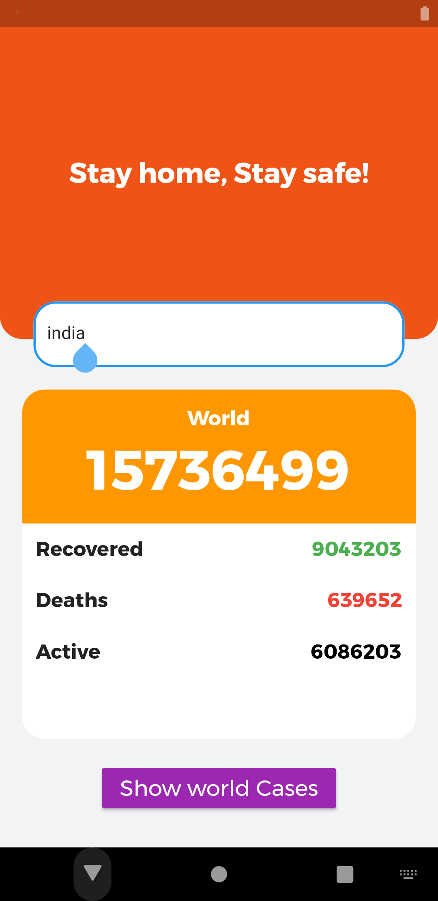
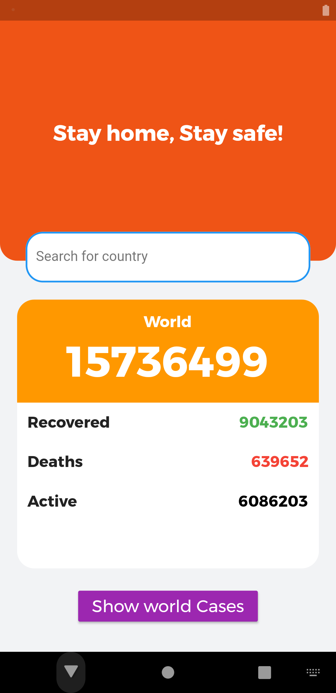
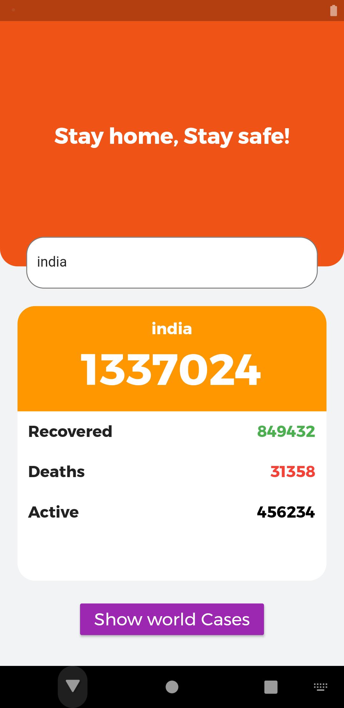

# Corona Virus Tracker App with flutter

Full corona virus tracker app made with flutter and api

## Features

* Live cases from the whole world
* Live cases for countries
* Users can search for a country
* Users can switch to world view

## Tutorial

Wanna learn how to make this : 

## Screenshots
  

